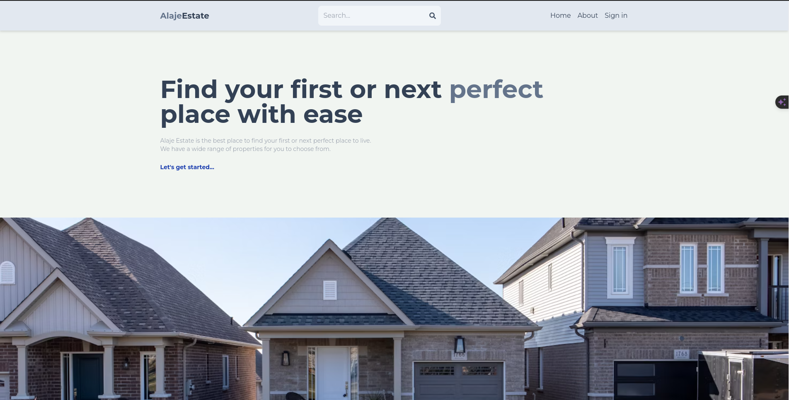

# Alaje Real Estate Marketplace

> Alaje Estate is a leading real estate agency that specializes in helping clients buy, sell, and rent properties in the most desirable neighborhoods. Our team of experienced agents is dedicated to providing exceptional service and making the buying and selling process as smooth as possible.



## ⚒️ Built with

- HTML
- JavaScript

## 🎞️ Frameworks and Technologies used

- React && Redux
- Tailwind CSS

## 🖥️ Live Demo

[Demo](https://alaje-real-estate.onrender.com/):point_left:

## 🖥️ Getting Started

To get a local version up and running on your machine, follow these simple example steps.

## 🛠️ Prerequisites

```
  Install Node.js on your machine
```

## 🕹️ Setup

```
  Clone the repository on your machine and cd into it
    https://github.com/Qoosim/alaje-real-estate-marketplace
    cd alaje-real-estate-marketplace
  run yarn
  run yarn start
```

## 👨‍💻 Author

👤 **Qoosim AbdulGhaniyy**

- GitHub: [Qoosim](https://github.com/Qoosim)
- LinkedIn: [Qoosim](https://www.linkedin.com/in/qoosim)

## 🤝 Contributing

Contributions, issues, and feature requests are welcome!

Feel free to check the [issues page](../../issues/).

## 📦 Show your support

Give a ⭐️ if you like this project!

## 👏 Acknowledgments

- Many thanks to Sahand for giving insight on the project layout on his live project
- Hat tip to anyone whose code was used
- Inspiration
- etc

## 📝 License

This project is [LICENSE](./LICENSE.md) licensed.
